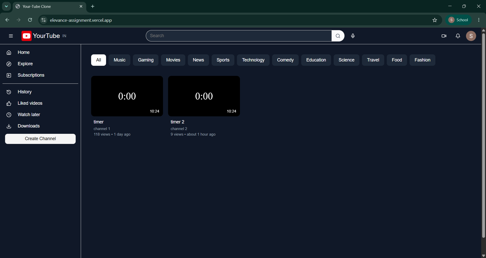
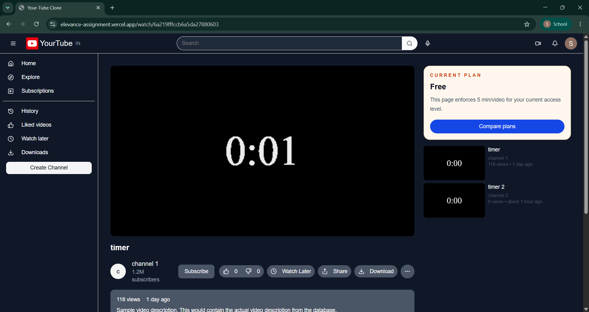
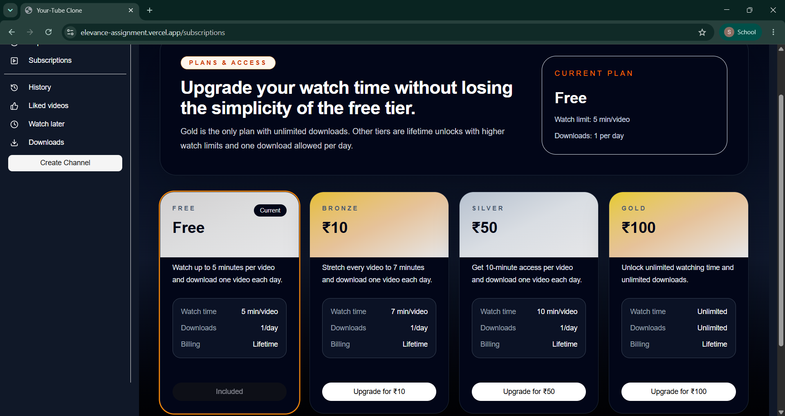
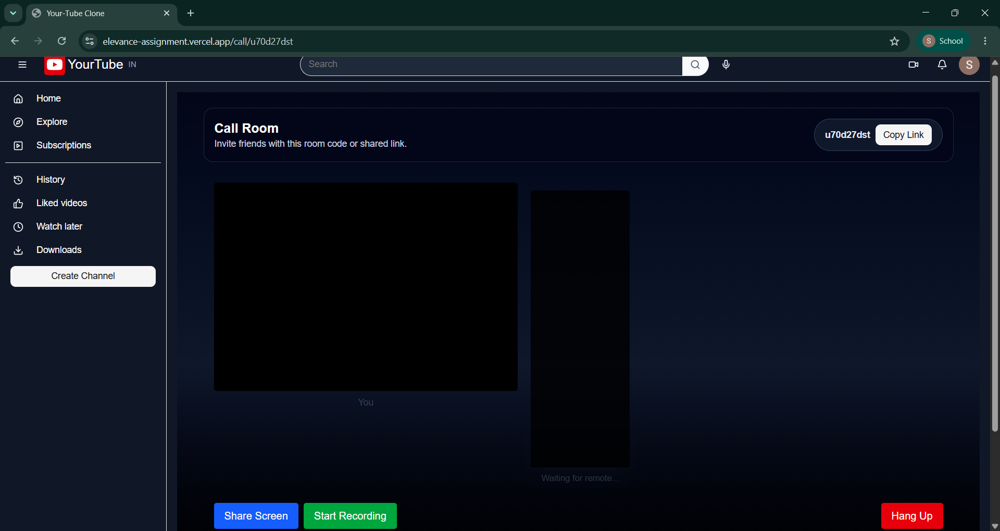
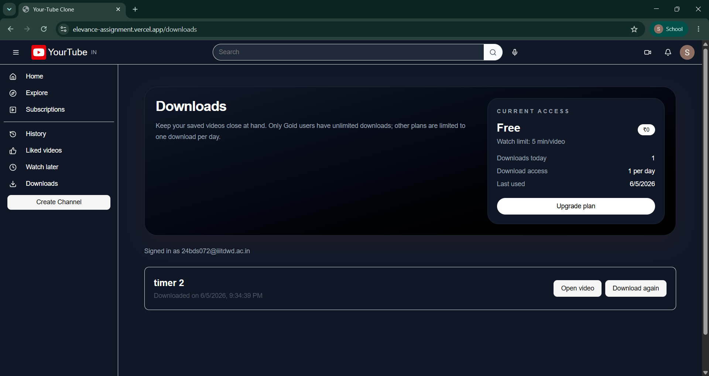

# YourTube

A full-stack YouTube-inspired application built as a monorepo with a Next.js frontend and an Express/MongoDB backend.

This repository includes:
- A modern React/Next.js frontend with Firebase login and OTP verification.
- An Express API server with MongoDB for user profiles, video metadata, comments, likes, history, downloads, and plan-based access.
- A protected watch session flow and real-time call room signaling via Socket.IO.

## Screenshots











## Repository structure

- `server/` – Express backend server
  - `index.js` – server entry point
  - `routes/` – API route definitions
  - `controllers/` – request handlers and business logic
  - `Modals/` – Mongoose models
  - `utils/` – utilities such as mailer and plan configuration
- `yourtube/` – Next.js frontend
  - `src/pages/` – app routes and page-level components
  - `src/components/` – reusable UI components
  - `src/lib/` – auth context, API axios instance, Firebase config, utility helpers
  - `src/styles/` – global CSS
  - `public/` – static assets and placeholder screenshot screenshots/images

## Core features

- Firebase authentication via Google sign-in
- OTP verification flow for email and mobile
- First-time mobile number collection for new users
- Video browsing with related recommendations
- Comments, likes, watch later, history, and downloads
- Plan-based access controls and watching limits
- Gold-only unlimited downloads; non-Gold users limited to 1 download per day
- Protected playback sessions and watch session enforcement
- Real-time call room signaling for peer connections
- Responsive UI with dark / light theming

## Authentication flow

1. User signs in with Google through Firebase.
2. The app calls backend `/user/login`.
3. If the user is new and lacks a mobile number, `MobileNumberDialog` prompts for it.
4. The mobile number is saved to the user profile.
5. OTP verification begins and the user enters the OTP in `OtpPromptDialog`.
6. User is authenticated and the profile is stored in local storage.

## Download / plan rules

- Only Gold users have unlimited downloads.
- Bronze, Silver, and Free users are limited to 1 download per day.
- Video watch limits increase with paid plans.
- Paid plans are lifetime unlocks in this app.

## Technology stack

- Frontend: Next.js, React, TypeScript, Tailwind CSS, Radix UI
- Backend: Node.js, Express, MongoDB, Mongoose, Socket.IO
- Authentication: Firebase Authentication, OTP verification
- HTTP client: Axios

## Prerequisites

- Node.js installed
- npm installed
- MongoDB instance available
- Firebase project configured for auth

## Environment setup

### Backend (`server/`)

Create a `.env` file in `server/` with:

```env
DB_URL=<your mongodb connection string>
PUBLIC_URL=http://localhost:3000
PORT=5000
```

- `DB_URL` – MongoDB connection URI
- `PUBLIC_URL` – frontend origin allowed by CORS
- `PORT` – optional, defaults to `5000`

### Frontend (`yourtube/`)

Create `.env.local` or configure `NEXT_PUBLIC_BACKEND_URL` in `yourtube/next.config.ts`:

```env
NEXT_PUBLIC_BACKEND_URL=http://localhost:5000
```

Ensure Firebase is configured in `yourtube/src/lib/firebase.js`.

## Install dependencies

From the repo root:

```bash
cd server
npm install
cd ../yourtube
npm install
```

## Run locally

### Start backend

```bash
cd server
npm run dev
```

### Start frontend

```bash
cd yourtube
npm run dev
```

Open the frontend at `http://localhost:3000`.

## Backend API summary

- `POST /user/login` – login or create a user
- `POST /user/send-otp` – generate and send OTP
- `POST /user/verify-otp` – verify OTP
- `PATCH /user/update/:id` – update user profile (mobile, channel name, description)
- `GET /user/:id` – get user profile data
- `POST /user/download/:videoId` – record a download
- `GET /user/downloads/:id` – fetch downloads for a user
- `POST /user/payment/order` – create a payment order
- `POST /user/payment/verify` – verify payment
- `POST /user/payment/test-email` – test email delivery

## Frontend scripts

From `yourtube/`:

- `npm run dev` – start the development app
- `npm run build` – build production files
- `npm run start` – run the built app
- `npm run lint` – lint the frontend code

## Deployment notes

- Use a persistent MongoDB database in production.
- Replace the placeholder OTP store with a real provider if needed.
- Configure Firebase and backend URLs for your deployment environment.

## Notes

- The README was updated for the current repository structure and recent code changes.
- Replace the screenshot placeholders with real screenshots in `yourtube/public/`.
- The frontend stores authenticated user state in `localStorage` and restores it on reload.
- The backend currently uses an in-memory OTP store, so OTP state is not preserved across server restarts.
